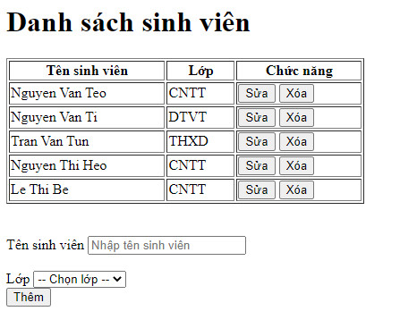

## Cho danh sách sinh viên và danh sách lớp như sau:

```js
const students = [
    {
        id: '1',
        name: 'Nguyen Van Teo',
        classId: '1'
    },
    {
        id: '2',
        name: 'Nguyen Van Ti',
        classId: '2'
    },
    {
        id: '3',
        name: 'Tran Van Tun',
        classId: '3'
    },
    {
        id: '4',
        name: 'Nguyen Thi Heo',
        classId: '1'
    },
    {
        id: '5',
        name: 'Le Thi Be',
        classId: '1'
    }
]

const classList = [
    {
        id: '1',
        name: "CNTT"
    },
    {
        id: '2',
        name: 'DTVT'
    },
    {
        id: '3',
        name: 'THXD'
    },
    {
        id: '4',
        name: 'XDDD'
    }
]
```

- Hiển thị danh sách sinh viên theo dạng bảng như sau:
- Thực hiện các công việc Thêm, Sửa, Xoá

