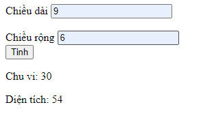
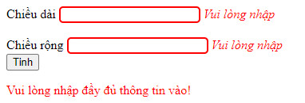
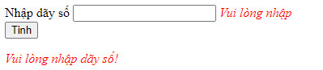
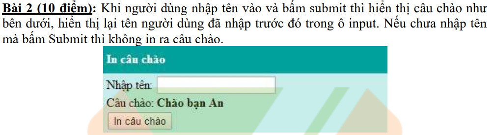
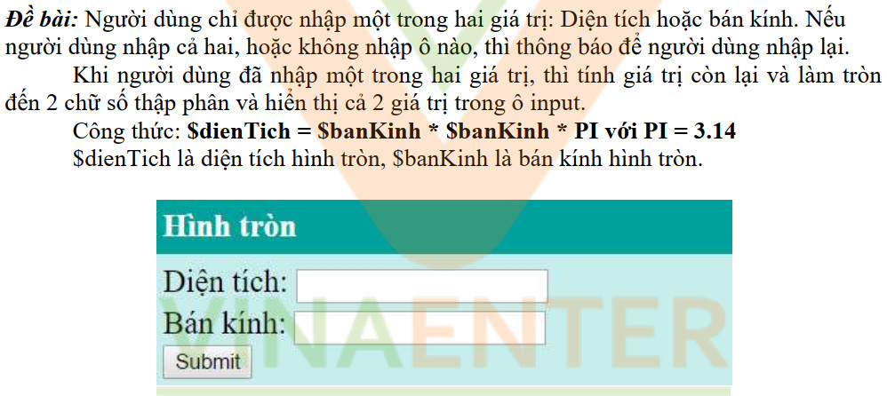
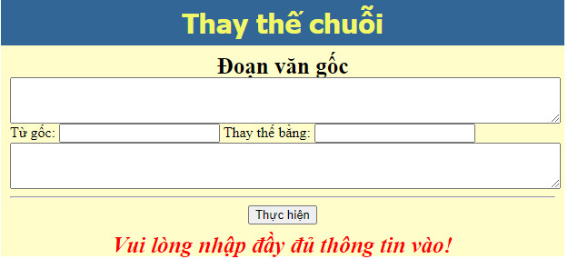

## Bài 1a: Tạo form để nhập chiều dài, chiều rộng. Khi bấm submit thì tính chu vi và diện tích hình chữ nhật

### Nếu chưa nhập mà bấm submit thì hiện thông báo lỗi

## Bài 1b: Tạo form để nhập dãy số. Khi bấm submit thì tính tổng của dãy số đã nhập

### Nếu chưa nhập mà bấm submit thì hiện thông báo lỗi

## Bài 2: 

## Bài 3:

## Bài 4:

### Nếu chưa nhập mà bấm submit thì hiện thông báo lỗi

## Bài 5: Xem code và ghi chép những gì học được