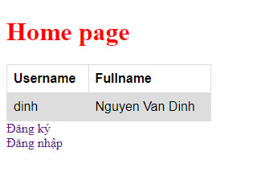
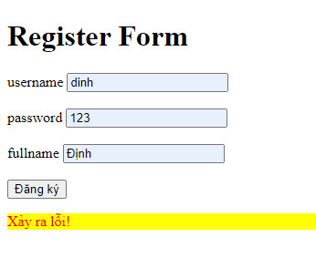
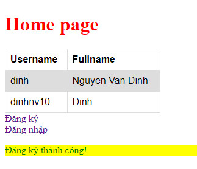
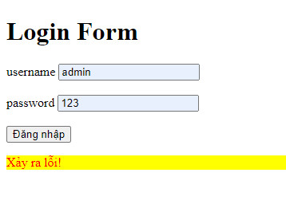
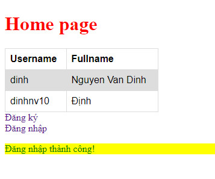

# Chương trình mô phỏng chức năng Đăng ký user và Đăng nhập

1. Chạy dòng lệnh **npm start** để khởi chạy server => file index.js

2. Truy cập trình duyệt ở địa chỉ http://localhost:3000/ để truy cập trang chủ

3. Chọn chức năng Đăng ký ở trang chủ, nhập thông tin username, password và fullname của user muốn đăng ký

- Nếu đăng ký user đã tồn tại thì hiển thị thông báo lỗi:

- Nếu đăng ký thành công thì chuyển sang trang chủ và hiển thị thông báo:

4. Chọn chức năng Đăng nhập ở trang chủ, nhập thông tin username, password của user muốn đăng nhập

- Nếu đăng nhập với user chưa tồn tại thì hiển thị thông báo lỗi:

- Nếu đăng nhập thành công thì chuyển sang trang chủ và hiển thị thông báo:

